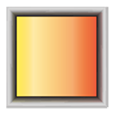

# General Aesthetics Notes

A powerful Chrome extension for enhanced note-taking across multiple web pages.



## Overview

General Aesthetics Notes is a feature-rich browser extension that transforms how you take notes while browsing. Designed for researchers, students, and professionals who need to collect and organize information from multiple web sources simultaneously.

## Key Features

- **Rich Text Formatting**: Style your notes with various text formatting options
- **Multi-tab Support**: Work with notes across different websites simultaneously
- **Screenshot Capture**: Grab visual content directly into your notes
- **URL Bookmarking**: Save and organize URL links within your notes
- **Persistent Caching**: No need to worry about losing content by accidentally closing the browser, you can instantly go back to where you last edited.
- **Tab Management**: Pin important tabs for quick access across different websites
- **List Creation**: Organize information with bulleted and numbered lists
- **Spreadsheet**: Create and edit spreadsheets within your notes

## Installation

### From Chrome Web Store
*(Coming soon)*

### Manual Installation (Developer Mode)
1. Clone this repository:
   ```bash
   git clone https://github.com/yourusername/general-aesthetics.git
   ```
2. Navigate to the extension directory:
   ```bash
   cd general-aesthetics/extension
   ```
3. Install dependencies:
   ```bash
   npm install
   ```
4. Build the extension:
   ```bash
   npm run build
   ```
5. Open Chrome and go to `chrome://extensions/`
6. Enable "Developer mode" in the top-right corner
7. Click "Load unpacked" and select the `dist` folder from the project directory

## Usage

1. Click the General Aesthetics icon in your browser toolbar to open the note panel
2. Create new notes or access existing ones
3. Use the formatting toolbar to style your text
4. Capture screenshots or save URLs with the dedicated buttons
5. Switch between tabs to manage notes for different websites

## Development

### Prerequisites
- Node.js (v14 or higher)
- npm (v6 or higher)

## License

This project is licensed under the MIT License - see the [LICENSE](LICENSE) file for details.

## Contributing

Contributions are welcome! Please feel free to submit a Pull Request.

## Support

If you encounter any issues or have questions, please file an issue on the GitHub repository.

## Stubboen Bug:

There is an issue involves empty spreadsheets disappearing when adding a title or switching tabs only when there's one exsisting tab, if more than 2 tabs are open, the issue will not happen. Sorry that I have not been able to fix it.